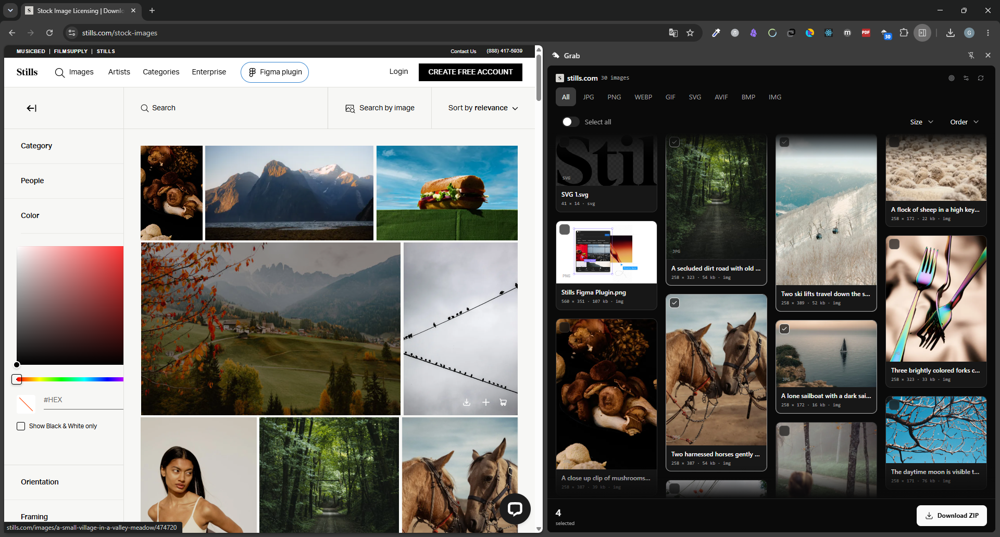
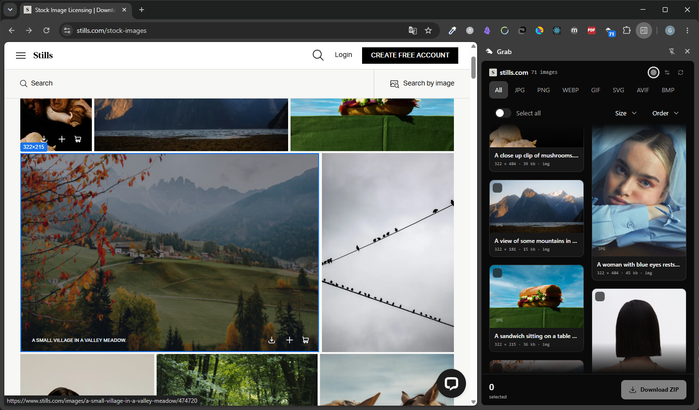
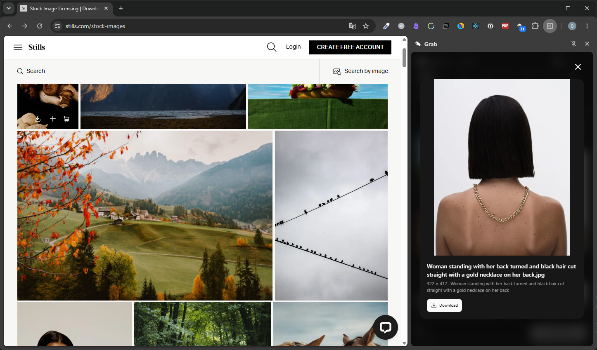

<div align="center">
  
  <h1>Grab</h1>
  <p>Chrome extension (Manifest V3) that collects every image on the current page into a side panel — filter, preview, and download them individually or as a structured ZIP.</p>
  
  <p>
    
    
  </p>
</div>

## Features

- **Deep page scan** — ``, `srcset`, `<source>`, CSS backgrounds, inline SVG, `<canvas>`, Open Graph / Twitter meta images, and lazy-load attributes (`data-src` and friends). Traverses Shadow DOM and all frames.
- **Live updates** — a lightweight `MutationObserver` watcher rescans silently as the page changes; the grid only re-renders when results actually differ.
- **Picker** — activate the inspector and click any image on the page to locate and select it in the panel.
- **Filters & sorting** — by format, minimum width, and order (document, dimensions, name, or file weight from `Content-Length`).
- **Downloads** — single file, drag & drop out of the panel, or ZIP with images categorized into folders (`photos/`, `vectors/`, `thumbnails_and_icons/`, `other/`) plus a `metadata.json` describing every asset.
- **Deduplication** — same image served at multiple resolutions is collapsed to the highest one; optional strict mode also normalizes protocol and tracking params.
- Settings (filters, advanced options) persist across sessions. Theme follows Chrome's.

## Install (from source)

```bash
npm install
npm run build        # → dist/
```

1. Open `chrome://extensions` and enable **Developer mode**.
2. Click **Load unpacked** and select the `dist/` folder.
3. Pin Grab and click its icon to open the side panel on any page.

Requires Chrome 114+.

## Development

```bash
npm run dev:extension   # fast rebuild (no typecheck)
npm run typecheck
```

Reload the extension from `chrome://extensions` after each build. To debug: right-click inside the panel → **Inspect**; the service worker console is available from the extension's card.

## Project layout

```
src/
  collector.ts        page-side script: single-pass DOM scan + mutation watcher
  inspector.ts        page-side script: click-to-pick overlay
  background.ts       service worker: side panel behavior, badge, theme
  App.tsx             side panel root
  hooks/              collection, filters, selection, downloads, storage
  services/           chrome APIs, ZIP building, downloads
  components/         grid, cards, toolbar, header, UI primitives
```

## Permissions

| Permission | Why |
|---|---|
| `activeTab`, `tabs`, `scripting` | inject the collector/inspector into the current page and react to tab changes |
| `sidePanel` | the entire UI lives in the side panel |
| `downloads` | save single images and ZIP archives |
| `storage` | persist user settings and theme |
| `<all_urls>` | fetch image bytes cross-origin from the panel (reachability checks, ZIP building) |

Grab makes no requests other than fetching the images you see; nothing is collected or sent anywhere.

## Privacy

No data is collected, stored, or transmitted — see the [privacy policy](PRIVACY.md).

## License

[MIT](LICENSE)
